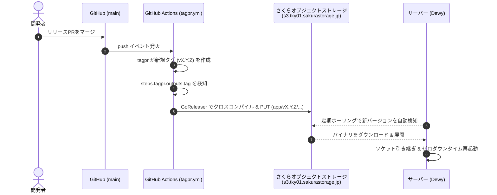

# Dewy Deployment Boilerplate & Toolkit

[](https://golang.org/)
[](LICENSE)
[](https://www.ansible.com/)
[](https://github.com/getsops/sops)
[](https://github.com/Songmu/tagpr)

このリポジトリは、**[Dewy](https://github.com/linyows/dewy)** による Go アプリケーションの**オブジェクトストレージ経由バイナリ自動デプロイ（ゼロダウンタイム切り替え）**を実現するための包括的なツールキット兼ボイラープレートです。

さくらのクラウド オブジェクトストレージ（**東京リージョン**: `s3.tky01.sakurastorage.jp`）をはじめとする S3 互換ストレージと連携し、リリースタグの自動付与（**tagpr**）、オブジェクトストレージへのマルチプラットフォーム自動 PUT（**GoReleaser / dewyctl**）、**Ansible** によるプロビジョニング、**SOPS + age** による暗号化シークレット管理、さらにこれらを一気通貫で操作・検証できる専用 CLI **`dewyctl`**（およびワンクリックランチャー **`run.sh`**）を提供します。

> [!NOTE]
> **ゼロダウンタイム切り替え検証ジャーニー**:
> ローカル環境（macOS Apple Silicon）から S3 へのリリース、Dewy によるバイナリ自動 PULL、プロセスソケット引き継ぎ（Graceful Restart）成功に至るまでの技術的課題と解決の軌跡は [docs/verification_journey.md](docs/verification_journey.md) にまとめています。

---

## 📦 インストール (`dewyctl`)

Go 1.21 以上がインストールされている環境であれば、以下のコマンドで `dewyctl` CLI を即座にグローバルインストールできます：

```bash
# リモートから直接インストール
go install github.com/sh0jitmy/dewyctl@latest

# または本リポジトリをクローンしてインストール
make install
# または
go install .
```

インストール後、ターミナルで `dewyctl` と入力するだけで対話型オペレーションメニューが起動します。

---

## 🚀 最短クイックスタート（設定からローカルテストまで 3ステップ）

手元にクラウド VM を用意しなくても、ローカルのホスト上または Docker 環境上で **Dewy デーモンの常駐 → オブジェクトストレージからの新バージョン自動検知 → ゼロダウンタイム展開 → E2E検証** までを数分で体感・テストできます。

### 前提ツール
- **Go** (v1.21 以上)
- **Docker**
- **Ansible** (`brew install ansible`)
- **sops** (`brew install sops`) & **age** (`brew install age`)

---

### ステップ 1: オブジェクトストレージの対話型設定
以下のコマンドを実行し、さくらのクラウド オブジェクトストレージの情報を入力します：

```bash
./run.sh config
# または
./bin/dewyctl config
```

対話プロンプトに従ってバケット名と認証情報を入力します：
```text
============================================================
  Configure Object Storage (S3) & Credentials for Dewy
============================================================
Enter your Sakura Cloud / S3 Object Storage credentials.
(Press Enter to keep the current/default value in brackets)

S3 Bucket Name (e.g. my-app-releases): <あなたのさくらバケット名>
S3 Access Key ID: <アクセスキーID>
S3 Secret Access Key: <シークレットアクセスキー>
S3 Endpoint URL [https://s3.tky01.sakurastorage.jp]: (Enterでデフォルト東京)
S3 Region [jp-east-1]: (Enterでデフォルト)

--> Encrypting credentials with SOPS...
[+] Successfully encrypted and saved to secrets.enc.yml
[+] Synced bucket & endpoint to ansible/group_vars/all/vars.yml

--> Testing S3 connection and bucket read/write permissions...
[OK] S3 Bucket access test PASSED! (Verified read/write on your-bucket)
```
入力完了と同時に、以下の設定ファイルが自動生成・同期され、S3 への疎通テストまで完走します：
- `key.txt`: age 秘密鍵（未作成時に自動生成）
- `.sops.yaml`: SOPS 暗号化設定
- `secrets.enc.yml`: SOPS 暗号化シークレット
- `ansible/group_vars/all/vars.yml`: Ansible 共通変数（バケット名・エンドポイント同期）

---

### ステップ 2: ゼロダウンタイム E2E 自動検証（ローカル & CI 両対応）

ホスト上で直接、あるいは CI (GitHub Actions) 上で、**初期版（v0.1.0）の配信 → Dewy サーバー起動 → 新版（v0.2.0）のリリース → ゼロダウンタイム自動切り替え検知** を 1 コマンドで完全自動検証できます：

```bash
./run.sh test
# または
./bin/dewyctl test
```

> [!TIP]
> **ゼロセットアップ & 自動インストール**:
> ホスト上に `dewy` バイナリがインストールされていない場合、公式 GitHub Releases から現在の OS/Arch（macOS / Linux, arm64 / amd64）に合致する最新バイナリを自動取得して実行します。事前セットアップは不要です。

```text
============================================================
  Starting Automated E2E Zero-Downtime Deployment Test
============================================================
[+] Target Application: dewy-app
[+] Release Flow: v0.1.0 -> v0.2.0
[+] Test Port: 8080

[1/5] Building and pushing initial version (v0.1.0)...
  -> Built dewy-app_darwin_arm64.tar.gz
  -> Uploaded to s3://.../app/v0.1.0/...

[2/5] Starting Dewy server in background...
  -> Dewy server running with PID: 12345
  -> Polling interval: 3s

[3/5] Verifying initial deployment (v0.1.0)...
  -> Health check OK: http://127.0.0.1:8080/health
  -> Endpoint response: OK - Version: v0.1.0

[4/5] Building and releasing upgrade version (v0.2.0)...
  -> Built dewy-app_darwin_arm64.tar.gz
  -> Uploaded to s3://.../app/v0.2.0/...

[5/5] Polling application endpoint for zero-downtime version switch...
  -> [1s] Current Version: v0.1.0 (waiting for Dewy switch)
  -> [3s] Version switch detected: v0.2.0!
  -> Testing consecutive requests for graceful handover...
     [Req 1] 200 OK (v0.2.0)
     [Req 2] 200 OK (v0.2.0)
     [Req 3] 200 OK (v0.2.0)

============================================================
[SUCCESS] E2E Zero-Downtime Test PASSED!
============================================================
```

また、常駐デーモンとして単独起動したい場合は `dewyctl server`、GoReleaser で S3 へリリースしたい場合は `dewyctl release` を使用できます：

```bash
# Dewy デーモンをフォアグラウンドで起動
./bin/dewyctl server --interval 5

# GoReleaser を使って S3 へリリース (SOPS認証情報を自動注入)
./bin/dewyctl release --version v1.0.0
```

---

### ステップ 3: ローカル Docker で一括テスト実行 (systemd検証)
Docker 上で実際の Linux systemd サービスとしての Dewy 常駐を検証したい場合は、一括検証コマンドを実行します：

```bash
./run.sh docker all --version v0.1.0
# または
./bin/dewyctl docker all --version v0.1.0
```

**このコマンド 1 つで自動実行される一連の流れ:**
1. **[Docker起動]**: systemd 稼働コンテナ（`target-server`）を起動
2. **[Ansible構成]**: Dewy デーモンをコンテナにインストールし、systemd サービスとして常駐・S3 ポーリング開始
3. **[S3へPUT]**: Go アプリをクロスコンパイルし、さくらオブジェクトストレージへ PUT
4. **[自動検知 & デプロイ]**: コンテナ内の Dewy が新バージョンを自動検知してダウンロード・展開・起動
5. **[E2Eテスト]**: コンテナの `:8080/health` およびバージョン一致（`v0.1.0`）を自動検証

---

### ステップ 4: ログと稼働確認
コンテナ内の Dewy デーモンの systemd ログを確認します：

```bash
./run.sh docker logs
# または
./bin/dewyctl docker logs
```

直接コンテナの HTTP エンドポイントへリクエストを送ってテストすることも可能です：
```bash
# コンテナ IP の取得 & ヘルスチェック
CONTAINER_IP=$(docker inspect -f '{{range .NetworkSettings.Networks}}{{.IPAddress}}{{end}}' target-server)
curl "http://${CONTAINER_IP}:8080/"
curl "http://${CONTAINER_IP}:8080/health"
```

検証コンテナを停止・削除したいときは：
```bash
./run.sh docker clean
```

---

## 🤖 CI / GitHub Actions での活用方法

`dewyctl test` は特定の環境（OSやDocker）に依存せず、macOS（ローカル開発環境）でも Linux（GitHub Actions Ubuntu ランナー）でも同一のコマンドで E2E テストを実行できます。

GitHub Actions で Pull Request や push 時に E2E テストを自動実行する例：

```yaml
name: E2E Zero-Downtime Test

on:
  pull_request:
    branches: [main]

jobs:
  e2e:
    runs-on: ubuntu-latest
    steps:
      - uses: actions/checkout@v4
      - uses: actions/setup-go@v5
        with:
          go-version: '1.22'

      - name: Decrypt Secrets
        uses: getsops/action@v1
        with:
          version: latest
        env:
          SOPS_AGE_KEY: ${{ secrets.SOPS_AGE_KEY }}

      - name: Run E2E Zero-Downtime Test
        run: |
          go build -C tools/dewyctl -o ../../bin/dewyctl .
          ./bin/dewyctl test --v1 v0.1.0 --v2 v0.2.0
```

---

## 🎮 対話型メニューモード (`./run.sh` または `dewyctl`)

コマンドを覚える必要はありません。引数なしで実行するだけで、全機能を番号選択で直感的に操作できます：

```bash
./run.sh
# または
./bin/dewyctl
```

```text
============================================================
           dewyctl - Dewy Operations & Toolkit
============================================================
 [作成支援 (プロジェクト初期化)]
  1) init           GoReleaser / tagpr / GitHub Actions / systemd の生成支援

 [設定・シークレット]
  2) config         S3 認証情報・バケット対話的設定 (SOPS暗号化)

 [ゼロダウンタイム E2E 自動検証 (ローカル & CI 両対応)]
  3) test           E2E 自動テスト (v1配信 -> Dewy起動 -> v2リリース -> 切替検証)
  4) server         Dewy サーバーを直接起動 (未インストール時は自動DL)
  5) release        GoReleaser でS3へリリース (SOPS認証情報を自動注入)
  6) push           バイナリを手動ビルドしてS3へ直接PUT

 [Docker 検証 (systemd環境)]
  7) docker all     一括実行 (Docker起動 + Ansible展開 + push + E2E検証)
  8) docker setup   Dockerコンテナ起動 + Ansible展開 (Dewyデーモン起動)
  9) docker verify  コンテナのE2Eテスト (:8080)
 10) docker logs    Dewy systemdログの表示
 11) docker clean   コンテナ停止・削除

 [診断]
 12) doctor         S3疎通・依存環境のヘルスチェック
  q) quit           終了
============================================================
Select option [1-12, q]: 
```

---

## 🛠️ CLI コマンドリファレンス (`dewyctl`)

| コマンド | 説明 |
| :--- | :--- |
| `dewyctl` (引数なし) | **対話型オペレーションメニュー**を起動（番号選択） |
| `dewyctl test [--v1 <ver>] [--v2 <ver>]` | **ゼロダウンタイム E2E 自動テスト**（v1配信 → Dewy起動 → v2配信 → 切替検証） |
| `dewyctl server [--interval <sec>]` | ホスト上で **Dewy デーモンを直接起動**（未インストール時は自動ダウンロード） |
| `dewyctl release [--version <ver>]` | **GoReleaser** で S3 へリリース（SOPS 認証情報を自動注入） |
| `dewyctl push --version <ver>` | Go アプリをクロスコンパイルし、オブジェクトストレージへ直接 PUT |
| `dewyctl config` | S3 認証情報・バケット設定、SOPS 暗号化、Ansible 同期、疎通テスト |
| `dewyctl init` | **GoReleaser** (`.goreleaser.yaml`), **tagpr** + **GitHub Actions**, systemd, starter コードの生成支援 |
| `dewyctl docker all [--version <ver>]` | Docker systemd 環境での一括検証（Docker起動 → Ansible → S3 push → E2E検証） |
| `dewyctl docker setup` | target-server コンテナ起動 ＋ Ansible 展開 (Dewyデーモン起動) |
| `dewyctl docker verify [--version <ver>]` | ローカルコンテナの `:8080/health` およびバージョン検証 |
| `dewyctl docker logs [--lines <n>]` | コンテナ内 Dewy systemd ログの確認 |
| `dewyctl docker clean` | target-server コンテナの停止・削除 |
| `dewyctl doctor` | S3 接続性（東京リージョン等）、環境変数、依存ツールの整合性を自動診断 |
| `dewyctl sops [init\|decrypt\|edit]` | SOPS + age による機密情報の暗号化管理 |
| `dewyctl ansible init` | Dewy 導入用 Ansible プレイブック・ロール一式の自動生成 |

---

## 🏗️ 全体アーキテクチャ

### 1. オブジェクトストレージ経由のゼロダウンタイム デプロイ
サーバー上で常駐する Dewy デーモンがオブジェクトストレージを定期監視し、新バージョンを検知すると自動ダウンロード・展開・ソケット引き継ぎ再起動（Graceful Restart）を実施します。

```mermaid
flowchart TD
    subgraph Storage ["オブジェクトストレージ (東京リージョン: s3.tky01.sakurastorage.jp)"]
        S3Bucket[("Bucket: app/v1.0.0/<br/>dewy-app_linux_amd64.tar.gz")]
    end

    subgraph Server ["デプロイ先サーバー (VM / VPS / ローカルDocker)"]
        Dewy["Dewy Daemon (systemd)<br/>--registry s3://..."]
        S3Bucket -.->|1. 定期ポーリング監視| Dewy
        S3Bucket ==>|2. 新バージョン取得・展開| Dewy
        
        subgraph ProcessManagement ["ゼロダウンタイム切り替え (server-starter)"]
            Socket["Listening Socket (:8080)"]
            OldProcess["旧プロセス (v1.0.0)"]
            NewProcess["新プロセス (v1.0.1)"]
            
            Socket --> OldProcess
            Dewy -->|3. 新プロセス起動 & ソケット引き継ぎ| NewProcess
            Socket --> NewProcess
            Dewy -->|4. Graceful Shutdown (SIGTERM)| OldProcess
        end
    end
```

### 2. tagpr 連動の自動リリースパイプライン (GitHub Actions)
プルリクエストをマージすると、同一ワークフロー内で自動的にタグ作成からオブジェクトストレージへの PUT、デプロイ検証までが完走します。



---

## 📁 プロジェクト構造

```
dewyctl/
├── main.go                        # dewyctl CLI エントリーポイント
├── go.mod / go.sum                # dewyctl モジュール定義 (github.com/sh0jitmy/dewyctl)
├── internal/                      # dewyctl コア機能
│   ├── cmd/                       # サブコマンド (test, server, release, push, config, init, docker, doctor)
│   ├── builder/                   # クロスコンパイラ (4プラットフォーム一括ビルド & プロジェクト名自動解決)
│   ├── dewy/                      # Dewy バイナリ自動検出・公式GitHub Releases自動DL
│   ├── s3/                        # S3 アップローダー & 接続性チェック
│   ├── sops/                      # SOPS / age 暗号化操作 & クレデンシャル透過ロード
│   ├── docker/                    # Docker コンテナ管理・Ansible実行・E2E検証
│   ├── ansible/                   # Ansible 構成自動生成
│   └── template/                  # GoReleaser / tagpr / systemd テンプレート
├── app/                           # デプロイ対象 Go アプリケーション本体
│   ├── main.go                    # server-starter ソケット引き継ぎ & Graceful Shutdown
│   └── main_test.go               # ユニットテスト
├── docs/
│   └── verification_journey.md    # ゼロダウンタイム自動切り替え検証ジャーニー
├── ansible/                       # Ansible プロビジョニング資産
│   ├── playbook-binary.yml        # バイナリモード用プレイブック
│   ├── inventory.ini              # インベントリ (target-server 等)
│   ├── roles/dewy/                # Dewy CLI インストールロール
│   └── group_vars/all/vars.yml    # S3 バケット名・エンドポイント等の設定値
├── .github/workflows/
│   ├── tagpr.yml                  # tagpr 自動リリース ＋ S3 PUT ＋ E2E 検証
│   └── deploy.yml                 # 手動タグ・手動トリガー用リリース & デプロイ検証
├── run.sh                         # ワンクリック運用ランチャー (自動ビルド付き)
├── Makefile                       # ビルド・テスト・品質チェック補助 Makefile
├── key.txt                        # age 非公開鍵 (.gitignore で除外)
└── secrets.enc.yml                # SOPS 暗号化シークレット (Git 管理可能)
```

---

## 🛠 開発・テスト & 品質チェック

本リポジトリではコードの品質保証とセキュリティ維持のため、テスト、静的解析 (Lint)、脆弱性診断 (govulncheck) を Makefile および GitHub Actions CI に標準組み込みしています。

```bash
# 全ユニットテストの実行 (dewyctl & sample app)
make test

# golangci-lint による静的解析
make lint

# govulncheck による依存関係脆弱性スキャン
make vulncheck

# 上記 3 つ (test, lint, vulncheck) を一括実行
make check
```

GitHub Actions CI (`.github/workflows/ci.yml`) では、PR 作成時および `main` ブランチへの push 時にこれらすべてのチェックが自動実行されます。

---

## 🔐 シークレット & 環境変数リファレンス

| 変数名 | 説明 | 例 / 推奨値 |
| :--- | :--- | :--- |
| `S3_ENDPOINT` | さくらのクラウド オブジェクトストレージ エンドポイント | `https://s3.tky01.sakurastorage.jp` (東京) |
| `S3_REGION` | S3 リージョン名 | `jp-east-1` |
| `S3_BUCKET` | リリースバイナリ保管用バケット名 | 例: `my-dewy-releases` |
| `AWS_ACCESS_KEY_ID` | オブジェクトストレージ アクセスキー ID | さくらクラウド管理画面で発行 |
| `AWS_SECRET_ACCESS_KEY` | オブジェクトストレージ シークレットアクセスキー | さくらクラウド管理画面で発行 |
| `SOPS_AGE_KEY` | GitHub Actions 用シークレット（`key.txt` の内容） | `AGE-SECRET-KEY-...` |

### GitHub Actions Secrets の設定

GitHub Actions（`tagpr` によるタグ自動作成後の S3 自動リリースや `deploy.yml`）を動作させるには、GitHub リポジトリの **Settings -> Secrets and variables -> Actions** に以下のシークレットを登録します（GitHub CLI を使って設定することも可能です）：

```bash
# 必須: S3 / さくらのクラウド オブジェクトストレージ設定
gh secret set S3_BUCKET -b "your-bucket-name"
gh secret set AWS_ACCESS_KEY_ID -b "your-access-key-id"
gh secret set AWS_SECRET_ACCESS_KEY -b "your-secret-access-key"

# 任意: SOPS による暗号化シークレット管理を利用する場合
gh secret set SOPS_AGE_KEY < key.txt

# 任意: デフォルト (東京リージョン) 以外を利用する場合
gh secret set S3_ENDPOINT -b "https://s3.tky01.sakurastorage.jp"
gh secret set S3_REGION -b "jp-east-1"
```

---


## 📄 License

This project is licensed under the [Apache License 2.0](LICENSE).
